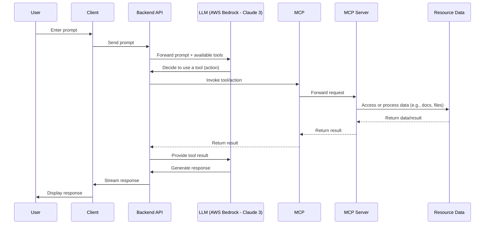

  

### Explanation of MCP Client-Side Workflow:

1.  **User Input**: The user types a message into the chat interface provided by CopilotKit UI on the Next.js frontend.

2.  **Frontend to Backend**: The frontend sends this prompt to the Next.js backend API endpoint (`/api/copilotkit/route.ts`).

3.  **CopilotKit Runtime & LLM**:

    - The backend API route uses the `CopilotRuntime`. This runtime is configured with a `LangChainAdapter` that interfaces with the AWS Bedrock LLM (Claude 3 Sonnet).
    - The `systemPrompt` (from `mcp.config.json`) and the defined agent actions (e.g., `awsDocumentationActions`, `wordAgentActions`) are provided to the LLM. The system prompt now specifically guides the LLM to use the Word agent for `SnowflakeAI.docx` when AI-related questions are asked.

4.  **LLM Decides on Tool Use**:

    - The LLM processes the input prompt and the available tools (actions). Based on the prompt and its understanding of the tool descriptions (and the guidance from the system prompt), it decides if a tool/action is needed.
    - If a tool is chosen, the LLM responds with the intent to call that tool and the required parameters.

5.  **Action Execution (MCP Interaction)**:

    - The `CopilotRuntime` receives the LLM's decision to use a tool.
    - The `handler` function associated with the chosen action (defined in files like `app/api/copilotkit/agents/wordAgent.ts`) is executed.
    - Inside these handlers, a utility function (previously `callMcpTool`, though the `README.md` example shows it more directly) would be responsible for making a request to the relevant MCP server (e.g., `word-document-server`).
    - **MCP Server Invocation**: The MCP servers are separate processes, typically started by `uvx` as defined in `mcp.config.json`. The backend API (acting as an MCP client) communicates with these MCP servers (e.g., over standard I/O if `uvx` is used directly, or potentially over HTTP if the MCP server exposes an HTTP interface).
    - The MCP server performs the requested operation (e.g., reading a Word file, searching AWS docs) and sends the result back to the action handler in the Next.js backend.

6.  **Result to LLM**: The action handler returns the result from the MCP server (usually as a JSON string) back to the `CopilotRuntime`, which then sends it to the LLM.

7.  **Final Response Generation**: The LLM uses the tool's output to formulate a final response to the user's original query.

8.  **Backend to Frontend**: This final response is streamed back from the Next.js backend to the frontend UI.

9.  **Display to User**: The frontend displays the LLM's response to the user.

This loop (User -> Backend -> LLM -> Backend (tool) -> MCP -> Backend (tool result) -> LLM -> Backend -> User) can continue if the LLM decides to use multiple tools or requires further interaction.

## Abstracted Workflow Diagram

The following diagram shows the high-level flow of a user prompt through the system, abstracting away implementation details:

